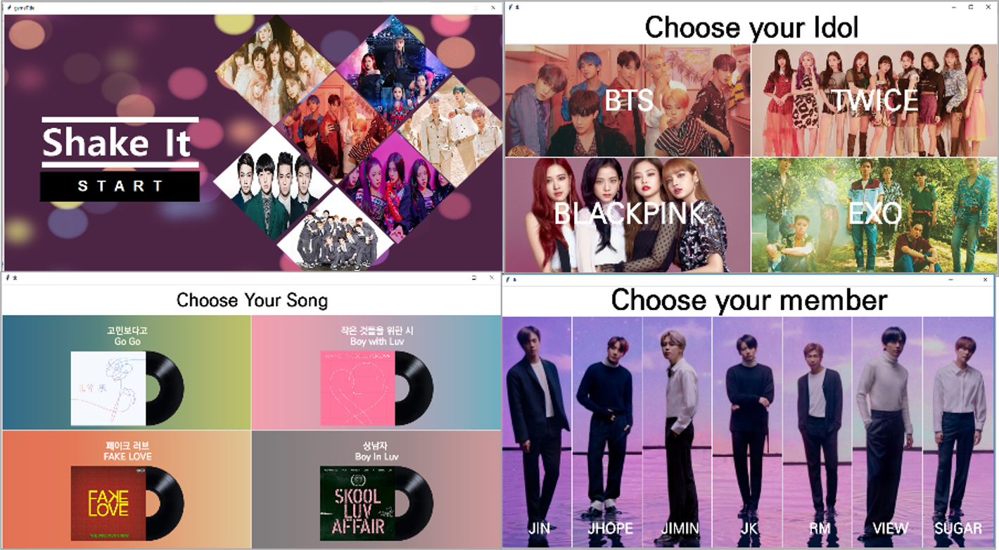

## 영상 이미지 분류를 활용한 K-POP 안무 티칭 서비스

  전세계적인 K-POP 인기 열풍에 따른 해외 팬들의 안무 커버(따라하기) 관심 급증K-POP 관심 급증에 따른 안무 티칭 서비스 개발

## 1. 사용 라이브러리

| **라이브러리** | **버전**            |
| -------------- | ------------------- |
| Keras          | 2.3.1               |
| opencv-python  | 4.2.0.34            |
| tensorflow     | 2.0.0               |
| jupyter        | 1.0.0               |
| numpy          | 1.18.4              |
| Pillow         | 7.1.2               |
| pip            | 20.0.2              |
| pyinstaller    | 4.0.dev0+9ece4547d7 |
| PyQt5          | 5.14.2              |
| h5py           | 2.10.0              |
| tkinter        | 0.3.1               |

## 2. 소스코드

● OpenPose : 이미지나 영상에서 사람의 주요 18개 관절을 찾아 자세를 추출하는 모델

## 3. 데이터셋

● 데이터의 특징을 추출하여 패턴을 파악하는 CNN 알고리즘을 통해 모델링을 수행

●  [데이터 전처리] 폴더

●  Video frame save: 좌우대칭 및 Grayscale 적용

●  img_skeleton.ipynb: 검은 바탕화면에 openpose모델로 검출한 skeleton만 띄움 

## 4. 서비스 알고리즘

●   [서비스 알고리즘] 폴더

●   Main.ipynb : 메인 알고리즘 코드

●   vgg19.h5 : 이미지 모델링을 통해 가중치를 저장한 파일

●   [CNN 모델학습] 폴더

●   DenseNet, MobileNet, VGG16, VGG19  모델링 코드

  

